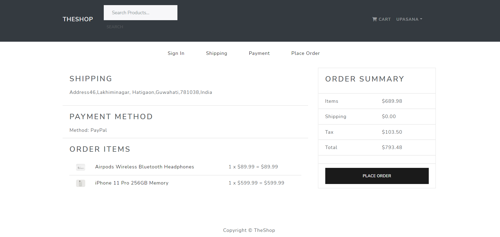
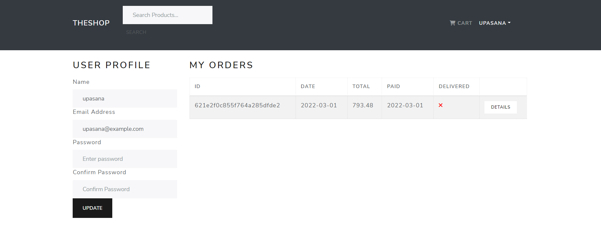

# PROSHOP - MERN Stack eCommerce

This is an eCommerce web application created with M(ongoDb)E(xpress)R(eact)N(ode) Stack. It has user authentication system, an admin user who can add new products in the app, check for order and payments and also choose which order has been delivered from the store. It is also connected to PayPal for payments. It is deployed in Heroku and below you can find the link to visit the app.

# Features

- Full featured shopping cart
- Product reviews and ratings
- Top products carousel
- Product pagination
- Product search feature
- User profile with orders
- Admin product management
- Admin user management
- Admin Order details page
- Mark orders as delivered option
- Checkout process (shipping, payment method, etc)
- PayPal / credit card integration
- Database seeder (products & users)

# Built with

- NodeJs
- Express
- ReactJs
- Redux
- MongoDb
- React Hooks
- React Bootstrap
- Axios
- Bcrypt
- JSON Web Tokens
- Prettier
- Eslint
- React Helmet

# Link to the app

https://theshopsite.herokuapp.com/
